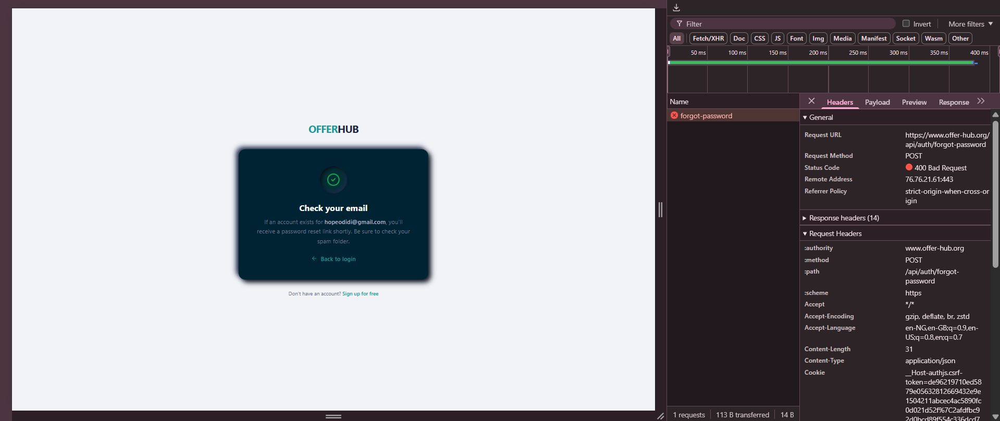
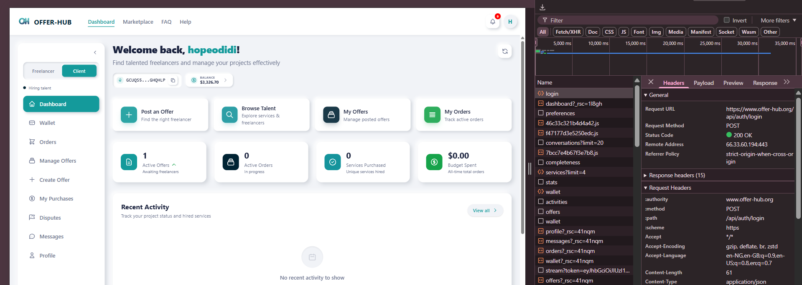

# Manual Test Report: Reset Password Flow
**Issue:** #1343  
**Tester:** Hope Odidi  
**Test Date:** May 31, 2026  
**Status:** ❌ BLOCKED

## 1. Test Objective
To verify that the recovery link received via email safely opens the password restoration form, updates the production database with the new credentials, and permits subsequent authentication.

## 2. Test Execution Details
* **Status:** **BLOCKED**
* **Reason:** This phase of the testing cycle could not be completed because the prerequisite stage (the execution of the "Forgot Password" email trigger documented in `Report_ForgotPassword_Issue_1343.md`) failed with a **403 Forbidden** error. 
* **Impact:** Because the backend blocked the request to send the email, no reset token or password recovery link could be generated or received in the inbox. 

## 3. Evidence & Screenshots

### Blocked State Verification (Re-verification of DevTools 403 API block)

### Active Registered Session (Proving account generation prior to test)

## 4. Next Steps for Resolution
1. **Fix Account Deletion Logic:** Update the user settings backend routing to allow Google/OAuth-authenticated accounts to delete their profile without hitting a password confirmation validator schema block.
2. **Fix Recovery Endpoint Permissions:** Resolve the **403 Forbidden** API restrictions on the recovery endpoint so the automated SMTP service can dispatch the recovery webhooks. Once fixed, this manual check will be re-run to verify token ingestion and password overrides.